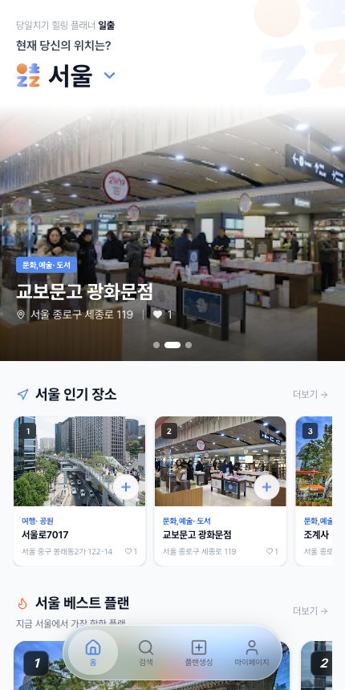
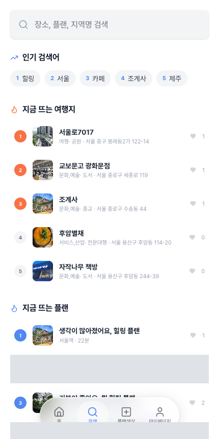
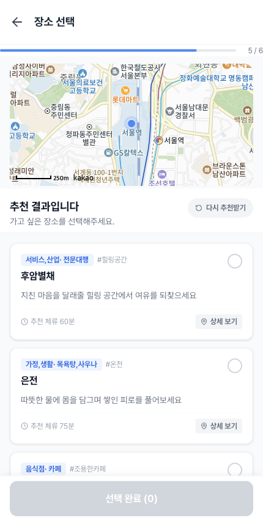
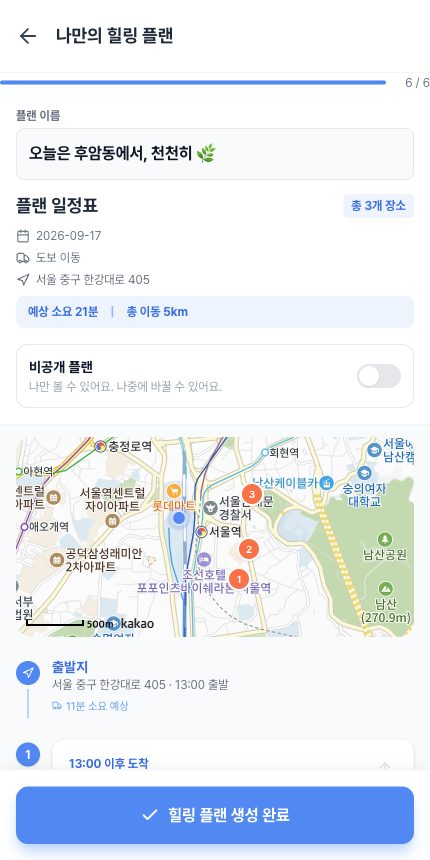
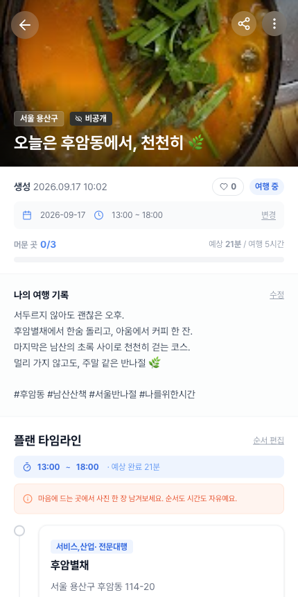

<p align="center">
  
</p>

<h1 align="center">일출 · ilchul</h1>

<p align="center">
  <strong>오늘의 마음에 맞춰, 가볍게 떠나는 하루.</strong><br />
  기분과 여유 시간에 맞는 여행을 제안하는 당일치기 힐링 플래너
</p>

<p align="center">
  <a href="https://il-chul.com">서비스 바로가기</a> · 팀 베개 · 2026 관광데이터 활용 공모전
</p>

## 서비스 소개

잠깐 쉬고 싶지만 어디로 가야 할지 막막할 때, 일출은 지금의 마음에서 여행을 시작합니다. 마음 상태와 이동수단, 여행 시간, 출발지를 입력하면 한국관광공사의 웰니스 관광정보와 주변 장소를 바탕으로 나에게 맞는 여행 후보를 추천합니다.

마음에 드는 장소를 골라 플랜을 만들고, 방문 순서를 조정하고, 머문 곳의 사진을 남길 수 있습니다. 다른 여행자의 공개 플랜을 둘러보고 내 일정으로 담는 것까지 하나의 흐름으로 연결합니다.

## 주요 화면

<table>
  <tr>
    <th>홈 · 인기 장소</th>
    <th>장소·플랜 검색</th>
    <th>맞춤 장소 추천</th>
  </tr>
  <tr>
    <td></td>
    <td></td>
    <td></td>
  </tr>
  <tr>
    <th>플랜 만들기</th>
    <th>나의 플랜</th>
    <th>기억 스탬프</th>
  </tr>
  <tr>
    <td></td>
    <td></td>
    <td></td>
  </tr>
</table>

2026년 9월 서비스 화면입니다. 기억 스탬프 이미지는 사진 등록 전 안내 화면이며, 장소별 방문 기록은 실제 위치 확인과 사진 제출 후 저장됩니다.

## 주요 기능

| 기능              | 사용 경험                                                                                                                 |
| ----------------- | ------------------------------------------------------------------------------------------------------------------------- |
| 마음에 맞는 추천  | 7가지 마음 상태 또는 직접 입력한 기분, 이동수단, 여행 일시와 출발지를 바탕으로 여행 후보를 추천합니다.                    |
| 장소와 플랜 탐색  | 장소·플랜·지역명을 검색하고 주변 및 전국의 인기 장소와 플랜을 둘러봅니다.                                                 |
| 나만의 일정 구성  | 추천 장소를 선택하고 방문 순서, 제목, 공개 여부를 정해 플랜을 저장합니다. 저장한 플랜의 일정과 순서도 편집할 수 있습니다. |
| 기억 스탬프       | 여행 당일, 장소 주변 150m 이내에서 현재 위치와 사진으로 머문 곳을 기록합니다.                                             |
| 여행 메모와 사진  | 내 플랜에 여행 메모와 사진을 남기고 장소별 방문 현황을 확인합니다.                                                        |
| 공개 플랜 공유    | 공개 플랜에 좋아요·댓글·답글을 남기고, 스크랩하거나 내 일정으로 담습니다.                                                 |
| 계정과 마이페이지 | 카카오 로그인 후 내 플랜, 저장한 플랜, 프로필을 관리합니다.                                                               |

### 여행을 만드는 흐름

**마음 상태 선택 → 이동 조건 입력 → 여행 일시 선택 → 출발지 설정 → 추천 장소 선택 → 플랜 저장**

저장한 플랜에서는 방문 순서와 일정을 관리하고, 여행 중에는 사진으로 기억 스탬프를 남깁니다. 공개한 플랜은 다른 이용자가 탐색하거나 자신의 일정으로 담을 수 있습니다.

> **오늘은 후암동에서, 천천히 🌿**<br />
> 후암별채 → 아움 → 남산공원<br />
> 서두르지 않아도 괜찮은 오후. 한숨 돌리고, 커피 한 잔, 마지막은 남산의 초록 사이로 천천히 걷는 코스.

## 관광 데이터와 외부 서비스

| 서비스                      | 활용                                                                                                |
| --------------------------- | --------------------------------------------------------------------------------------------------- |
| 한국관광공사 웰니스관광정보 | `WellnessTursmService/locationBasedList`로 출발지 주변 웰니스 장소를 조회해 추천 후보에 반영합니다. |
| Kakao Local · Maps          | 장소·주소 검색, 출발지 선택, 지도 표시와 장소 위치 확인에 사용합니다.                               |
| Kakao Mobility              | 경유지를 포함한 경로의 거리와 예상 이동시간을 조회합니다.                                           |
| Google Places               | 장소 검색과 사진 조회로 장소 대표 이미지를 보완합니다.                                              |
| Anthropic Claude            | 설문 응답과 조회된 장소 후보를 바탕으로 방문 장소, 순서, 추천 이유를 구성합니다.                    |
| Kakao Login                 | 계정 로그인에 사용합니다.                                                                           |

추천은 **설문 조건으로 검색 범위 결정 → 웰니스·지역 장소 수집 → 장소 매칭 및 중복 제거 → AI 선택 → 결과 검증** 순서로 처리합니다. AI가 고른 장소가 실제 후보 목록에 있는지 확인한 뒤 결과를 반환합니다.

현재 경로 미리보기는 카카오 자동차 길찾기 API를 사용합니다. 도보·대중교통 선택은 추천 조건에 반영되지만, 화면의 경로 소요시간은 해당 이동수단의 전용 길찾기 결과와 다를 수 있습니다.

## 기술 구성

| 영역           | 기술                                                                        |
| -------------- | --------------------------------------------------------------------------- |
| Frontend       | Next.js 15 · React 19 · TypeScript · Zustand · Tailwind CSS · Sass · Motion |
| Backend        | Java 21 · Spring Boot 3.5 · Spring Security · Spring Data JPA · WebClient   |
| 데이터         | MySQL · Redis · Flyway                                                      |
| 이미지 저장    | S3 호환 Object Storage                                                      |
| 검증           | Jest · Spring Boot Test · MockWebServer                                     |
| 빌드·배포 구성 | GitHub Actions · GHCR · Docker Compose · Nginx · Blue/Green                 |

브라우저는 Next.js 화면에서 백엔드 API를 호출합니다. 일부 인증·문의 요청은 Next.js Route Handler를 거치며, 백엔드는 추천·플랜·방문 기록과 외부 API 연동을 담당합니다.

## 저장소 구조

```text
ilchul/
├── frontend/
│   ├── src/app/                 # 페이지와 서버 Route Handler
│   ├── src/features/            # 추천·플랜·검색·프로필 등 기능
│   ├── src/shared/              # 공통 UI, API, 상태, 유틸리티
│   ├── src/widgets/             # 레이아웃과 화면 공통 영역
│   └── public/                  # 로고, 폰트, 정적 이미지
├── backend/
│   ├── src/main/java/com/begae/backend/
│   │                           # 도메인별 API·서비스·저장소
│   ├── src/main/resources/
│   │   ├── db/migration/       # Flyway 스키마 변경 이력
│   │   └── prompts/            # 추천 프롬프트
│   └── src/test/               # 백엔드 테스트
├── docs/images/                 # README 서비스 화면
├── nginx/                       # 게이트웨이 설정
├── docker-compose.*.yml         # Blue/Green 및 Nginx 구성
└── .github/workflows/           # CI/CD
```

## 로컬 실행

저장소의 CI는 Node.js 20, Yarn, JDK 21을 사용합니다. 백엔드는 Gradle Wrapper를 제공하며, 실행 전에 개발용 MySQL·Redis와 외부 API 설정이 필요합니다.

위 화면과 기능 소개는 배포된 서비스 기준입니다. `dev-be` 등 개별 개발 브랜치는 프런트엔드 변경의 반영 시점에 따라 화면과 지원 스크립트가 다를 수 있습니다.

### 1. 백엔드 환경 설정

[application.yml](backend/src/main/resources/application.yml)에 정의된 값을 실행할 셸이나 IDE의 환경변수로 주입합니다. 현재 설정은 루트 `.env`를 자동으로 읽지 않습니다.

| 구분                 | 환경변수                                                                                                                                                              |
| -------------------- | --------------------------------------------------------------------------------------------------------------------------------------------------------------------- |
| MySQL                | `MYSQL_DRIVER`, `MYSQL_URL`, `MYSQL_DATABASE`, `MYSQL_USER`, `MYSQL_PASSWORD`                                                                                         |
| Redis                | `REDIS_DB` — 포트 기본값은 `6379`                                                                                                                                     |
| 인증                 | `JWT_SECRET_KEY`, `ADMIN_PASSWORD`, 선택 사항 `ADMIN_USERNAME`                                                                                                        |
| 카카오               | `KAKAO_REST_API_KEY`, `OAUTH_KAKAO_CLIENT_SECRET`, `OAUTH_KAKAO_REDIRECT_URI`                                                                                         |
| 기타 OAuth 등록 설정 | `OAUTH_GOOGLE_CLIENT_ID`, `OAUTH_GOOGLE_CLIENT_SECRET`, `OAUTH_GOOGLE_REDIRECT_URI`, `OAUTH_NAVER_CLIENT_ID`, `OAUTH_NAVER_CLIENT_SECRET`, `OAUTH_NAVER_REDIRECT_URI` |
| 추천·장소            | `TOUR_API_KEY`, `GOOGLE_API_KEY`, `ANTHROPIC_API_KEY`                                                                                                                 |
| 프런트엔드 주소      | `FRONTEND_BASE_URL`                                                                                                                                                   |
| 이미지 저장소        | `STORAGE_ENDPOINT`, `STORAGE_BUCKET_NAME`, `STORAGE_REGION`, `STORAGE_PUBLIC_URL`                                                                                     |
| 저장소 인증          | AWS SDK 기본 자격증명 체인 — 예: `AWS_ACCESS_KEY_ID`, `AWS_SECRET_ACCESS_KEY`                                                                                         |

`MYSQL_DRIVER`는 `com.mysql.cj.jdbc.Driver`, `MYSQL_URL`은 `localhost:3306` 같은 호스트·포트 형식입니다. JDBC URL 전체가 아닙니다. 현재 사용자 로그인 화면은 카카오를 제공하지만, 백엔드 설정에는 Google·Naver 등록도 있으므로 해당 환경변수도 구성해야 합니다.

로컬 프런트엔드 주소는 `http://localhost:3000`이며, 카카오 콜백은 `http://localhost:8080/login/oauth2/code/kakao`를 기준으로 개발용 앱에 등록합니다. 지도 JavaScript 키에도 사용할 웹 도메인을 등록해야 합니다. 비밀 키는 README나 소스 코드에 넣지 않습니다.

### 2. 백엔드 실행

저장소 루트에서 실행합니다.

```bash
cd backend
./gradlew bootRun
```

기본 주소는 `http://localhost:8080`입니다. 앱 시작 시 Flyway가 연결된 DB에 마이그레이션을 적용하므로, 로컬 실행에는 별도의 개발용 DB를 지정합니다. 이미지 업로드까지 사용하려면 저장소 버킷과 브라우저에서 접근 가능한 `STORAGE_PUBLIC_URL`도 준비해야 합니다.

### 3. 프런트엔드 실행

`frontend/.env.local`에 개발용 공개 설정을 작성합니다.

```dotenv
NEXT_PUBLIC_API_BASE_URL=http://localhost:8080
NEXT_PUBLIC_KAKAO_MAP_APP_KEY=<카카오 JavaScript 키>
BACKEND_INTERNAL_URL=http://localhost:8080
```

`BACKEND_INTERNAL_URL`은 Next.js 서버의 API 호출에 사용합니다. 지정하지 않으면 `NEXT_PUBLIC_API_BASE_URL`을 사용합니다. `NEXT_PUBLIC_*` 값은 브라우저 번들에 포함되므로 서버용 비밀 키를 넣지 않습니다.

외부 이미지 호스트는 [frontend/next.config.ts](frontend/next.config.ts)의 `images.remotePatterns`를 확인합니다. `NEXT_PUBLIC_IMAGE_HOSTS`를 읽는 설정이 반영된 브랜치에서는 해당 환경변수에 저장소 호스트를 쉼표로 구분해 추가할 수 있습니다.

새 터미널을 열고 저장소 루트에서 실행합니다.

```bash
cd frontend
yarn install --frozen-lockfile
yarn dev
```

브라우저에서 `http://localhost:3000`에 접속합니다. 로컬에서 전체 로그인 흐름을 사용하려면 OAuth 리다이렉트 주소와 쿠키·CORS 설정이 실행 도메인에 맞아야 합니다.

## 테스트와 빌드

각 명령은 저장소 루트에서 해당 디렉터리로 이동한 뒤 실행합니다.

```bash
# Frontend
cd frontend
yarn tsc --noEmit
yarn build
```

프런트엔드 단위 테스트는 `frontend/package.json`에 `test` 스크립트가 있는 브랜치에서 `yarn test --runInBand`로 실행합니다. 현재 `dev-be`에는 해당 스크립트가 없습니다.

```bash
# Backend — 별도 터미널, 저장소 루트 기준
cd backend
./gradlew test
./gradlew bootJar
```

백엔드 테스트 설정은 [application-test.yml](backend/src/test/resources/application-test.yml)을 참조합니다. 테스트 프로필은 H2를 사용하고 Flyway를 끕니다. 외부 API·OAuth·이미지 업로드의 실제 연동은 단위 테스트와 별도로 확인해야 합니다.

현재 Next.js 설정은 빌드 중 ESLint 오류를 무시하도록 되어 있으므로, 빌드 성공이 린트 통과를 뜻하지는 않습니다.

## API 문서와 개발 규칙

- 로컬 Swagger UI: `http://localhost:8080/swagger-ui.html` — 설정한 관리자 Basic 인증이 필요합니다.
- OpenAPI: `http://localhost:8080/v3/api-docs` — 동일하게 인증이 필요합니다.
- 스키마 변경 이력: [backend/src/main/resources/db/migration](backend/src/main/resources/db/migration)
- 작업 규칙: [AGENTS.md](AGENTS.md)
- 빌드·배포 워크플로: [.github/workflows/deploy.yml](.github/workflows/deploy.yml)

적용된 마이그레이션은 수정하지 않고 새 버전을 추가합니다. 운영 DB 변경과 배포는 로컬 개발 실행과 구분해 진행합니다.

## 팀

**베개** · 2026 관광데이터 활용 공모전 출품작<br />
문의: [begae4@gmail.com](mailto:begae4@gmail.com)
